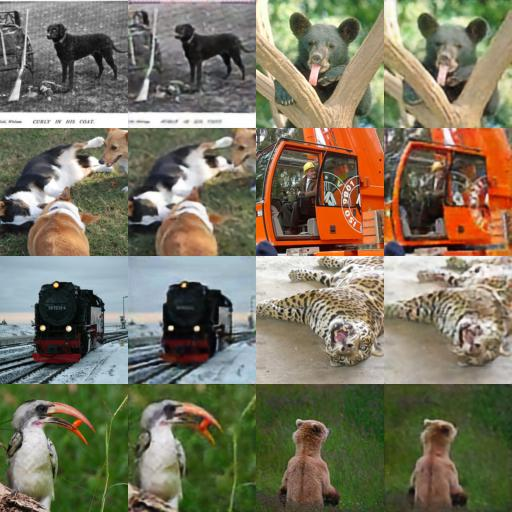

# VQ-VAE

This is a lightweight (200 loc) implementation of the VQ-VAE [Neural Discrete representation learning](https://arxiv.org/pdf/1711.00937.pdf).  

# Training
By default it trains on cifar10

```
python vq-vae-img.py
```
Edit hyperparams, paths in source code to train on ImageNet  

### ImageNet reconstruction after 40k iterations (K=512, D=128)


# License
MIT
